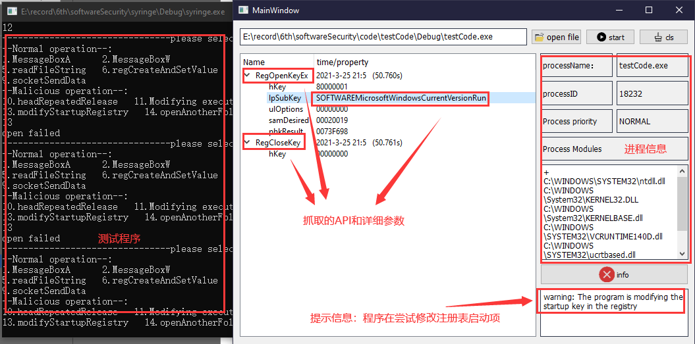

# [PFSafetyGuard](https://github.com/AgentGuo/PFSafetyGuard):sunflower:

## 1. Get start

### 1.1 项目介绍

项目主要有四个部分：

* [testCode](https://github.com/AgentGuo/PFSafetyGuard/tree/main/testCode)：测试程序，主要包含一些我们需要抓取的API和异常操作
* [PFDLL](https://github.com/AgentGuo/PFSafetyGuard/tree/main/PFDLL)：定义了需要HOOK的winAPI和替换的函数
* [syringe](https://github.com/AgentGuo/PFSafetyGuard/tree/main/syringe)：注射器程序，主要将[PFDLL](https://github.com/AgentGuo/PFSafetyGuard/tree/main/PFDLL)程序中的替换函数替换测试程序[testCode](https://github.com/AgentGuo/PFSafetyGuard/tree/main/testCode)中的API
* [PFSafetyGuard](https://github.com/AgentGuo/PFSafetyGuard/tree/main/PFSafetyGuard)：图形界面程序，接收[PFDLL](https://github.com/AgentGuo/PFSafetyGuard/tree/main/PFDLL)程序勾取的信息，然后做一些行为异常分析

### 1.2 run it

项目运行环境：

* detours库：[配置过程](https://blog.csdn.net/weixin_44338712/article/details/115261358)
* QT 5.9

然后需要修改程序中硬编码的一些路径（懒得改了:laughing:）

* [PFSafetyGuard/syringe/syringe/Source.cpp](https://github.com/AgentGuo/PFSafetyGuard/blob/main/syringe/syringe/Source.cpp)：line34 - line39
* [PFSafetyGuard/PFSafetyGuard/myThread.cpp](https://github.com/AgentGuo/PFSafetyGuard/blob/main/PFSafetyGuard/myThread.cpp)：line24

then run it

## 2. 简要展示

